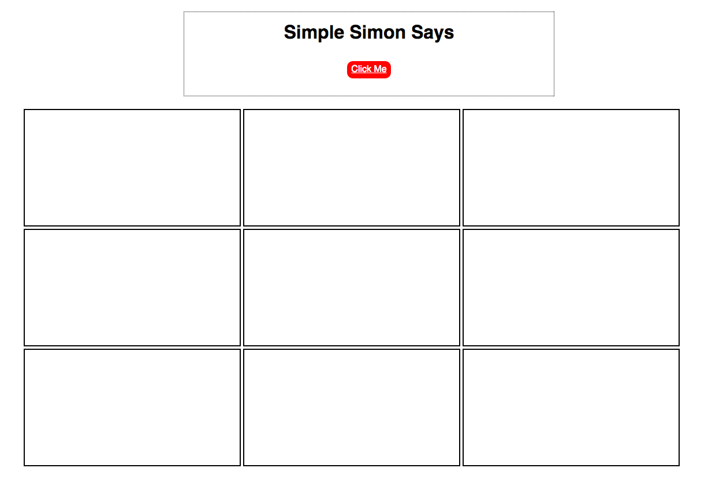
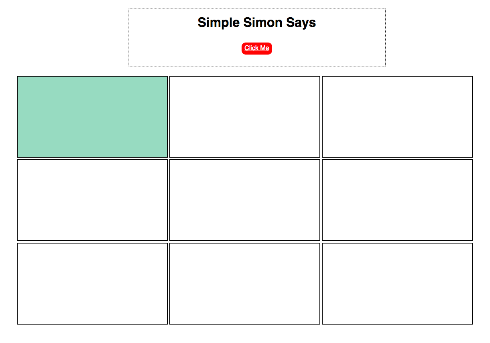
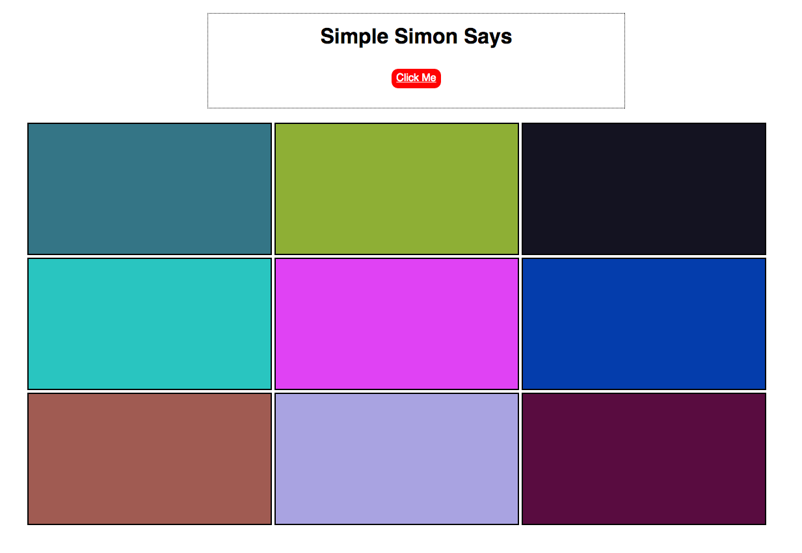

# Simon Says
## Introduction
This app mimics the behavior shown in [this exciting video](http://player.vimeo.com/video/65261103)
##Learning Competencies 
  * Write custom event handlers in JavaScript and jQuery
  * Use AJAX actions to change views based on async data
  * Use JSON to pass data via and AJAX call and modify the DOM

## Technologies
* JavaScript
* Ajax
* jQuery
* Sinatra
 
## Running
NOTE: Make sure you are using ruby version 1.9.X.

Navigate to the `simon-says` directory and in the shell run:
```sh
$ bundle install
$ bundle exec shotgun
```
In the browser: (http://localhost:9393/)

## Screenshots
Start:



Click me once:



Or click me a bunch!:

