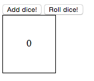
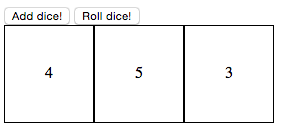

# JavaScript Refactor Procedural To OO
 
## Summary
As a professional programmer, you'll wind up dealing with some very hairy
JavaScript. This challenge asks you to take some procedural code
and refactor it to object oriented JavaScript.

## Goals 
* Implement clean and flexible interfaces between objects
* Decompose a problem in various dimensions including (but not limited to): separation of concerns, Law of Demeter, frequency of use, frequency of change, encapsulation, loose coupling, and the single-responsibility principle
* Write OO JavaScript

## Running

In your shell:
```sh
$ open source/js-refactor-to-oo/app.html
```

Alternatively, navigate to the app.html file and double click.

## Screenshots
Start:


Add a Die:



Or add multiple and LET 'EM ROLL!!!:

